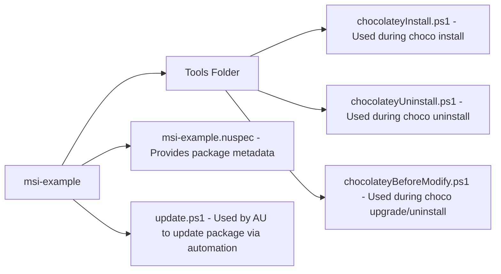

# Chocolatey MSI Package Example

This repository serves as a template for those looking to author a Chocolatey package for an MSI-based installer.

## Chocolatey Package Folder Structure

This layout is common for a Chocolatey package which works with an MSI installer

## Terminology

- Nuspec: This file contains package metadata (id,verion,author,description,dependencies,etc)
- toolsDir: This is the tools directory of the package
- Nupkg: (Properly pronounced nup-keg) This is the compiled Chocolatey package as a result of running the `choco pack` command
- AU: This is Automatic Updater, provided by the Chocolatey-AU PowerShell module. This tool automates package updates.

---

## Install script

The `chocolateyInstall.ps1` script is executed by Chocolatey when a user runs the `choco install` command. This script contains all of the logic necessary to ensure that the installation of the software via an MSI is completed successfully.

For more information about `choco install` see the documentation for the [Chocolatey Install Command](https://docs.chocolatey.org/en-us/choco/commands/install/)

## Uninstall script

The `chocolateyUninstall.ps1` script is executed by Chocolatey when a user runs the `choco uninstall` command. It is _typically optional to include_ as when using an MSI based installer, Chocolatey has a > 95% success rate at automatically removing the software when uninstalling the Chocolatey package via Chocolatey's AutoUninstaller feature.

For more information about `choco uninstall` see the documentation for the [Chocolatey Uninstall Command](https://docs.chocolatey.org/en-us/choco/commands/uninstall/)

## Upgrade script

The `chocolateyBeforeModify.ps1` script is executed by Chocolatey when a user runs either the `choco upgrade` or `choco uninstall` command. This is an optional script, but is extremely helpful when a piece of software may need to retain a file or a setting as the software is upgraded to the new version provided by the package. If applicable (meaning a chocolateyBeforeModify.ps1 file has been included), the version of this script from the currently installed package version will be run before subsequent `chocolateyInstall.ps1` or `chocolateyUninstall.ps1` scripts execute.

To give an example:

When upgrading a package from version `1.0.0` to version `2.0.0`, the chocolateyBeforeModify.ps1 script of version `1.0.0` will be executed _before_ Chocolatey executes the chocolateyInstall.ps1 script of version `2.0.0`. This allows the chocolateyBeforeModify.ps1 script in version 2.0.0 to provide new instructions should subsequent upgrades past version `2.0.0` differ.

For more information about `choco uninstall` see the documentation for the [Chocolatey Uninstall Command](https://docs.chocolatey.org/en-us/choco/commands/upgrade/)

## Automatic Package Updates

Using the `Chocolatey-AU` PowerShell module it is possible to automate the updating of a Chocolatey package as new versions of a piece of software (or whatever the package cares about) are released. This is done by providing an `update.ps1` file in the package folder, and using some form of Automation such as a CI/CD tool like GitHub Actions, or a Scheduled Task running locally on your workstation.

## More help

You can find a walk-through tutorial in the Chocolatey documentation. See [Create An Msi Package](https://docs.chocolatey.org/en-us/guides/create/create-msi-package/).

You can find a pre-built Lab using AutomatedLab [here](https://github.com/steviecoaster/ChocoLabs/tree/main/Labs/Chocolatey) which has all the tools you need to author your first Chocolatey package if you just want an ephemeral approach to trying it out, or install them on your own workstation!

Join the conversation on Chocolatey's discord! Join [here](https://ch0.co/community)!
